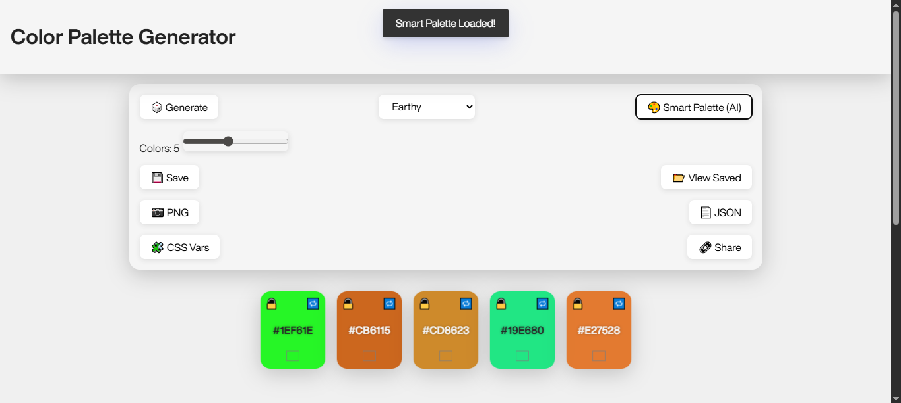

# 🎨 Color Palette Generator

A sleek, theme-based Color Palette Generator built with HTML, CSS, and JavaScript.

## ✨ Features

- 🎨 Generate random palettes based on color **themes** (Pastel, Vibrant, Earthy, Monochrome, etc.)
- 🔒 Lock colors to keep them while generating new ones
- 🌐 Share palettes via **URL parameters**
- 💾 Save last palette and settings using `localStorage`
- 📋 Click to **copy color codes** with toast notification
- 📥 Download palettes as `.json` files
- 🌙 Glassmorphism UI with light/dark mode toggle

## 🚀 Getting Started

1. Clone the repository or download the ZIP
2. Open `index.html` in your browser
3. Choose a theme and generate your own color palettes!

## 🛠 Technologies

- HTML5, CSS3 (Glassmorphism UI)
- JavaScript (Vanilla)
- [Toastify](https://apvarun.github.io/toastify-js/) for notifications

## 🧠 Ideas to Expand

- Add color harmony options (complementary, triadic)
- Export as image or CSS code
- Integrate AI-generated palettes (e.g., Colormind API)

## 📸 Screenshot

## 📄 License

MIT License — free to use and modify.
